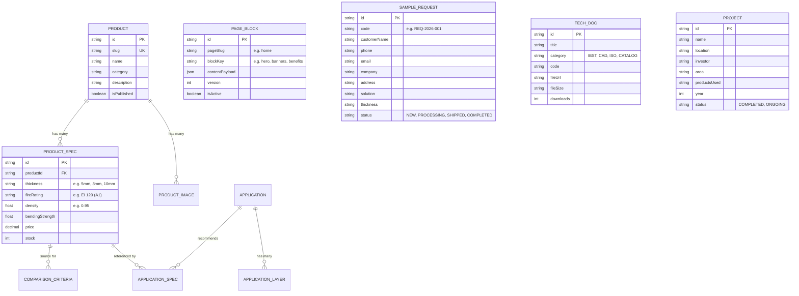

# 🏛️ TÀI LIỆU KIẾN TRÚC 3 LỚP & KẾ HOẠCH TRIỂN KHAI THEO GIAI ĐOẠN (PHASE ROADMAP)
**Dự Án:** Hệ Thống Website & CMS Quản Trị Tấm Chống Cháy MGO Remak® FireOFF  
**Tiêu Chuẩn Kỹ Thuật:** Chuẩn PCCC QCVN 06:2022/BXD • Kiến Trúc Phân Tầng Chịu Tải Cao  
**Ngày Khởi Tạo:** 30/09/2026 • **Phiên Bản:** 1.0.0

---

## 📌 MỤC LỤC
1. [Tổng Quan Kiến Trúc 3 Lớp Bắt Buộc](#1-tổng-quan-kiến-trúc-3-lớp-bắt-buộc)
2. [Quy Tắc Kiến Trúc Bất Khả Xâm Phạm](#2-quy-tắc-kiến-trúc-bất-khả-xâm-phạm)
3. [Chiến Lược Cache Đa Tầng & Cơ Chế Chịu Lỗi (Resilience)](#3-chiến-lược-cache-đa-tầng--cơ-chế-chịu-lỗi-resilience)
4. [Mô Hình Dữ Liệu Một Nguồn Sự Thật (Single Source of Truth)](#4-mô-hình-dữ-liệu-một-nguồn-sự-thật-single-source-of-truth)
5. [Lộ Trình Triển Khai Chi Tiết Từng Phase](#5-lộ-trình-triển-khai-chi-tiết-từng-phase)
   - [Phase 1: Hạ Tầng & Môi Trường Local (Docker Compose)](#phase-1-hạ-tầng--môi-trường-local-docker-compose)
   - [Phase 2: Khởi Tạo Backend NestJS & Core Infrastructure](#phase-2-khởi-tạo-backend-nestjs--core-infrastructure)
   - [Phase 3: Prisma Schema & Di Trú Dữ Liệu (Seed Data)](#phase-3-prisma-schema--di-trú-dữ-liệu-seed-data)
   - [Phase 4: Xây Dựng REST API Modules & Revalidation Webhook](#phase-4-xây-dựng-rest-api-modules--revalidation-webhook)
   - [Phase 5: Dịch Vụ Lưu Trữ File (MinIO) & Hàng Đợi Email (BullMQ)](#phase-5-dịch-vụ-lưu-trữ-file-minio--hàng-đợi-email-bullmq)
   - [Phase 6: Tích Hợp Frontend Next.js & Đường Ống ISR (Public Site)](#phase-6-tích-hợp-frontend-nextjs--đường-ống-isr-public-site)
   - [Phase 7: Chuyển Đổi CMS (/admin) Sang API Chuẩn Hóa](#phase-7-chuyển-đổi-cms-admin-sang-api-chuẩn-hóa)
   - [Phase 8: Kiểm Thử Chịu Lỗi (Failover Test) & Sẵn Sàng Vận Hành](#phase-8-kiểm-thử-chịu-lỗi-failover-test--sẵn-sàng-vận-hành)

---

## 1. TỔNG QUAN KIẾN TRÚC 3 LỚP BẮT BUỘC

```
[ CLIENT TRÌNH DUYỆT / GOOGLE BOT / THIẾT BỊ DI ĐỘNG ]
                        │
                        ▼
┌────────────────────────────────────────────────────────┐
│  TẦNG 1: FRONTEND & CMS (Next.js 14+ App Router)       │
│  • Public Pages: SSG / ISR (revalidate ≤ 60s)          │
│  • CMS (/admin): Phân hệ quản trị, gọi chung REST API  │
│  • TUYỆT ĐỐI KHÔNG kết nối trực tiếp DB (No Prisma/pg) │
│  • Endpoint Revalidation: POST /api/revalidate         │
└──────────────────────────┬─────────────────────────────┘
                           │ HTTP REST (Bearer JWT / Secret)
                           ▼
┌────────────────────────────────────────────────────────┐
│  TẦNG 2: BACKEND API (NestJS + TypeScript)             │
│  • RESTful API Endpoints + DTO Validation Pipe         │
│  • Auth: JWT Token + Role Guard (Admin, Editor)        │
│  • Cache Manager: Redis 7 (TTL 300s - 1800s)           │
│    ➜ Fallback an toàn: Redis chết vẫn truy vấn DB OK   │
│  • Queue Manager: BullMQ + Redis (Gửi mail nền)        │
│  • Storage Service: MinIO / S3 SDK (PDF, DWG, Images)  │
│  • Revalidation Webhook: Bắn tín hiệu sang Next.js     │
└──────────────┬───────────────────────────┬─────────────┘
               │                           │
       (Cache/Session/Queue)       (Data Queries via Prisma)
               ▼                           ▼
┌─────────────────────────────┐ ┌────────────────────────┐
│  Redis 8.10.2               │ │  PostgreSQL 18.6       │
│  • Cache response           │ │  • Single Source of    │
│  • Rate limit (900s)        │ │    Truth cho Specs MGO │
│  • BullMQ Jobs              │ │  • Prisma Migrations   │
└─────────────────────────────┘ └────────────────────────┘
               │
               ▼
┌────────────────────────────────────────────────────────┐
│  DỊCH VỤ LƯU TRỮ & THÔNG BÁO                           │
│  • MinIO / AWS S3: Bản vẽ CAD DWG, kết quả đốt lò IBST │
│  • Mailpit (Dev) / SMTP (Prod): Mail xác nhận & Lead   │
└────────────────────────────────────────────────────────┘
```

---

## 2. QUY TẮC KIẾN TRÚC BẤT KHẢ XÂM PHẠM

1. **Không Hardcode Nội Dung:** Mọi chuỗi ký tự, tiêu đề, hình ảnh và tài liệu hiển thị đều phải đọc từ Database thông qua Backend API. Chỉ các nhãn cố định giao diện (như *"Đang tải...", "Lỗi mạng"*...) mới được nằm trong mã nguồn.
2. **Frontend Chỉ Gọi API:** Tuyệt đối không cài đặt hoặc sử dụng Prisma Client / pg driver trong Next.js, kể cả ở các Server Components.
3. **Chiến Lược Render Bắt Buộc:** Mọi trang công khai (Public) phải áp dụng **SSG hoặc ISR (`revalidate ≤ 60s`)**, cấm CSR-only. Khi CMS xuất bản thay đổi, Backend sẽ kích hoạt On-demand Revalidation để trang cập nhật ngay tức thì.
4. **Một Nguồn Sự Thật Duy Nhất (Single Source of Truth):** Toàn bộ thông số sản phẩm MGO (độ dày, EI, tỷ trọng, độ bền uốn, giá) được định nghĩa tại bảng thông số Database và tái sử dụng cho Trang chủ, Trang sản phẩm, Bảng so sánh, Datasheet và Schema SEO. Cấm nhập liệu trùng lặp.
5. **Cô Lập Môi Trường:** Tách biệt triệt để `.env.development` và `.env.production`. Tuyệt đối không commit file `.env` lên Git.

---

## 3. CHIẾN LƯỢC CACHE ĐA TẦNG & CƠ CHẾ CHỊU LỖI (RESILIENCE)

### 3.1. Thứ Tự Ưu Tiên Phục Vụ Request
1. **Lớp 1: Next.js Static / ISR Cache:** Phục vụ ngay lập tức từ bộ nhớ cache của Next.js (thời gian phản hồi `< 20ms`).
2. **Lớp 2: Redis Cache (API Response):** Khi Next.js fetch API, Backend kiểm tra Redis cache (thời gian phản hồi `< 5ms`).
3. **Lớp 3: PostgreSQL Database:** Nếu cache miss, Backend truy vấn Database qua Prisma, cập nhật lại vào Redis với TTL quy định, sau đó trả về cho Frontend.

### 3.2. Quy Chuẩn Đặt Tên Key Redis (Convention)
| Định Dạng Key | Thời Gian Sống (TTL) | Mục Đích Sử Dụng |
| :--- | :--- | :--- |
| `page:{slug}` | `300s` (5 phút) | Cache dữ liệu toàn trang công khai |
| `blocks:home` | `300s` (5 phút) | Cache dữ liệu cấu hình các section trang chủ |
| `specs:mgo` | `600s` (10 phút) | Cache ma trận thông số kỹ thuật tấm MGO |
| `settings:global` | `1800s` (30 phút) | Cache thông tin nhà máy, hotline, cấu hình chung |
| `ratelimit:{ip}:{route}` | `900s` (15 phút) | Giới hạn tần suất gọi API phòng ngừa DDoS |

### 3.3. Quy Tắc Chịu Lỗi Bắt Buộc (Resilience)
> **[QUAN TRỌNG]** Sự cố Redis **KHÔNG ĐƯỢC PHÉP** làm sập hệ thống hoặc gây lỗi 500 cho người dùng:
> - Toàn bộ kết nối và truy vấn Redis trong NestJS phải được bọc trong khối `try-catch`.
> - Nếu Redis timeout hoặc disconnect: Hệ thống tự động **fallback thẳng xuống PostgreSQL** để trả dữ liệu bình thường, đồng thời ghi log cảnh báo `[WARN] Redis connection down. Fallback to DB query`.

### 3.4. Luồng Xóa Cache Chủ Động (On-Demand Purge)
```
Admin bấm [Lưu/Xuất Bản] trong CMS
         │
         ▼
[Backend NestJS]
 1. Cập nhật dữ liệu vào PostgreSQL
 2. Xóa các Redis key liên quan (ví dụ: `del blocks:home`, `del specs:mgo`)
 3. Gửi HTTP POST sang Next.js: `${NEXT_PUBLIC_SITE_URL}/api/revalidate`
    kèm header: Authorization: Bearer {REVALIDATE_SECRET_TOKEN}
    body: { tags: ["home", "products"], paths: ["/"] }
         │
         ▼
[Frontend Next.js]
 Xác thực Token ➜ Thực thi revalidateTag() & revalidatePath() ➜ Cache trang chủ được làm mới ngay!
```

---

## 4. MÔ HÌNH DỮ LIỆU MỘT NGUỒN SỰ THẬT (SINGLE SOURCE OF TRUTH)



---

## 5. LỘ TRÌNH TRIỂN KHAI CHI TIẾT TỪNG PHASE

### PHASE 1: Hạ Tầng & Môi Trường Local (Docker Compose)
* **Mục tiêu:** Dựng toàn bộ các dịch vụ phụ trợ chạy local độc lập, đồng bộ môi trường giữa các thành viên.
* **Các công việc cụ thể:**
  1. Viết file `docker-compose.yml` ở thư mục gốc chứa 4 services:
     - `postgres`: Image `postgres:15-alpine`, cấu hình Volume lưu trữ bền vững, cấu hình User/Pass/DB name.
     - `redis`: Image `redis:7-alpine`, cấu hình persistent snapshot AOF/RDB.
     - `minio`: Image `minio/minio`, thiết lập storage S3-compatible + Console UI.
     - `mailpit`: Image `axllent/mailpit:v1.31.3`, web UI kiểm tra email dev.
  2. Tạo file mẫu `.env.example` quy định toàn bộ biến môi trường cho cả 3 tầng.
  3. Khởi chạy thử nghiệm `docker compose up -d` và kiểm tra sức khỏe của từng container.

---

### PHASE 2: Khởi Tạo Backend NestJS & Core Infrastructure
* **Mục tiêu:** Dựng khung ứng dụng NestJS chuẩn kiến trúc module doanh nghiệp, tích hợp Prisma và hệ thống Cache chịu lỗi.
* **Các công việc cụ thể:**
  1. Khởi tạo thư mục `backend/` bằng NestJS CLI với TypeScript.
  2. Cài đặt các thư viện lõi: `@prisma/client`, `prisma`, `ioredis`, `@nestjs/jwt`, `@nestjs/passport`, `passport-jwt`, `bcrypt`, `class-validator`, `class-transformer`, `@nestjs/bullmq`, `bullmq`.
  3. Cấu hình `PrismaModule` kết nối tới PostgreSQL.
  4. Xây dựng `RedisModule` & `CacheService`:
     - Tích hợp connection pool `ioredis`.
     - Hiện thực hóa logic **Cache Fallback** (nếu Redis chết thì bypass truy vấn trực tiếp xuống DB và ghi log cảnh báo).
  5. Xây dựng Global Interceptor và Global Exception Filter để format response API chuẩn:
     `{ success: true, statusCode: 200, data: ..., timestamp: ... }`.

---

### PHASE 3: Prisma Schema & Di Trú Dữ Liệu (Seed Data)
* **Mục tiêu:** Hiện thực hóa cơ sở dữ liệu quan hệ, tạo các bảng và nạp dữ liệu mẫu ban đầu từ FE sang DB.
* **Các công việc cụ thể:**
  1. Soạn thảo `prisma/schema.prisma` đầy đủ các Model:
     - `User` (Admin Auth).
     - `Product` & `ProductSpec` (Bảng thông số kỹ thuật - Single Source of Truth).
     - `Application` & `ApplicationLayer` (Giải pháp thi công ống gió, vách ngăn).
     - `Comparison` (Tiêu chí so sánh đối đầu).
     - `TechDoc` (Hồ sơ đốt lò IBST, bản vẽ CAD DWG).
     - `Project` (Dự án tiêu biểu).
     - `SampleRequest` (Yêu cầu gửi mẫu).
     - `PageBlock` (Dữ liệu các block giao diện động trang chủ: Banners, Hero, Benefits, FAQ).
  2. Chạy migration đầu tiên: `pnpm prisma migrate dev --name init_db`.
  3. Viết script `prisma/seed.ts` để đọc toàn bộ dữ liệu đang có trong `src/data/*.ts` và insert vào DB, bảo toàn 100% dữ liệu hiện hữu.

---

### PHASE 4: Xây Dựng REST API Modules & Revalidation Webhook
* **Mục tiêu:** Cung cấp đầy đủ các endpoint RESTful có validation và cơ chế tự động xóa cache.
* **Các công việc cụ thể:**
  1. **AuthModule:** Đăng nhập `/api/auth/login`, cấp phát JWT, mã hóa bcrypt.
  2. **PageBlocksModule:**
     - `GET /api/page-blocks/home`: Trả về dữ liệu trang chủ (Banners, Hero, Benefits, FAQ) có bọc Redis cache `blocks:home`.
     - `PUT /api/page-blocks/home/:blockKey`: Cập nhật block, xóa key Redis và gọi Webhook revalidate.
  3. **ProductsModule:**
     - `GET /api/products`: Lấy danh sách sản phẩm.
     - `GET /api/products/specs/matrix`: Lấy ma trận độ dày (Spec Matrix) có bọc Redis cache `specs:mgo`.
     - CRUD Products & Specs (dành cho Admin).
  4. **ApplicationsModule, TechDocsModule, ProjectsModule, ComparisonsModule**: Tương tự theo chuẩn REST.
  5. **SampleRequestsModule:**
     - `POST /api/sample-requests`: Public endpoint cho khách hàng gửi form, đẩy job gửi mail vào BullMQ Queue.
     - `GET /api/sample-requests`: Admin theo dõi và đổi trạng thái.
  6. **RevalidateModule:**
     - Service chuyên trách gửi POST sang `${FRONTEND_URL}/api/revalidate` kèm Token bí mật mỗi khi có thao tác Publish trong CMS.

---

### PHASE 5: Dịch Vụ Lưu Trữ File (MinIO) & Hàng Đợi Email (BullMQ)
* **Mục tiêu:** Xử lý file đính kèm kỹ thuật (CAD/PDF) và email thông báo bất đồng bộ không làm chậm request.
* **Các công việc cụ thể:**
  1. **StorageModule:**
     - Tích hợp `@aws-sdk/client-s3`.
     - Viết hàm upload file lên MinIO (Local) hoặc AWS S3 (Production).
     - Hỗ trợ tạo Presigned Download URL cho tài liệu kiểm định IBST và bản vẽ CAD.
  2. **MailModule & Queue:**
     - Cấu hình BullMQ kết nối Redis.
     - Tạo Queue `email-queue` và Processor xử lý gửi email qua Nodemailer.
     - Mẫu email HTML: Xác nhận tiếp nhận mẫu cho khách hàng + Báo email khẩn cấp cho phòng kinh doanh Remak khi có Lead mới.

---

### PHASE 6: Tích Hợp Frontend Next.js & Đường Ống ISR (Public Site)
* **Mục tiêu:** Chuyển đổi toàn bộ trang chủ và các trang công khai từ đọc file tĩnh sang gọi API Backend qua ISR.
* **Các công việc cụ thể:**
  1. Xây dựng API Client trung tâm: `src/lib/api-client.ts` sử dụng `fetch` của Next.js có cấu hình `{ next: { revalidate: 60, tags: [...] } }`.
  2. Tạo On-Demand Revalidation Route Handler: `src/app/api/revalidate/route.ts` xác thực Bearer token bí mật.
  3. Nối API vào các Component trang chủ:
     - `HomeBannerSwiper.tsx` ➜ Đọc từ API `GET /api/page-blocks/home/banners`.
     - `HomeHeroSection.tsx` ➜ Đọc từ API `GET /api/page-blocks/home/hero`.
     - `HomeSpecMatrix.tsx` ➜ Đọc từ API `GET /api/products/specs/matrix`.
     - `ComparisonTable.tsx` ➜ Đọc từ API `GET /api/comparisons`.
     - `SampleRequestForm.tsx` ➜ POST trực tiếp lên Backend API `POST /api/sample-requests`.

---

### PHASE 7: Chuyển Đổi CMS (/admin) Sang API Chuẩn Hóa
* **Mục tiêu:** Toàn bộ thao tác quản trị trên giao diện `/admin` đều gửi request REST API kèm JWT token lên Backend.
* **Các công việc cụ thể:**
  1. Cập nhật `src/lib/admin-auth.ts`: Gọi endpoint `/api/auth/login` và lưu JWT Token.
  2. Chuyển đổi các trang admin sang gọi Backend:
     - `/admin/homepage/banners` ➜ Gọi `PUT /api/page-blocks/home/banners`.
     - `/admin/products` ➜ Gọi CRUD `/api/products`.
     - `/admin/sample-requests` ➜ Gọi `GET /api/sample-requests` & `PATCH /api/sample-requests/:id/status`.
  3. Thêm hiển thị thông báo phản hồi On-demand Cache Purge thành công ngay trên giao diện CMS.

---

### PHASE 8: Kiểm Thử Chịu Lỗi (Failover Test) & Sẵn Sàng Vận Hành
* **Mục tiêu:** Đảm bảo hệ thống đạt độ ổn định 99.99%, kiểm chứng các cam kết kỹ thuật.
* **Các kịch bản kiểm thử (Test Scenarios):**
  1. **Test On-demand Revalidation:** Đổi banner trong CMS ➜ Bấm Lưu ➜ Kiểm tra trang chủ Next.js cập nhật tức thì dưới 1 giây.
  2. **Test Redis Failover:** Chạy lệnh `docker stop redis` ➜ Tải lại trang chủ và gọi API backend ➜ Hệ thống vẫn phản hồi 200 OK bình thường (Fallback sang Postgres thành công).
  3. **Test Queue Email:** Khách điền form nhận mẫu ➜ Mailpit nhận được 2 email ngay lập tức mà không làm đơ giao diện người dùng.
  4. **Kiểm tra Single Source of Truth:** Sửa giá hoặc chỉ số EI của tấm MGO 12mm trong bảng Specs ➜ Tự động cập nhật đồng bộ ở cả trang chủ, bảng so sánh và trang sản phẩm.

---

## 📅 MA TRẬN PHÂN CHIA NHIỆM VỤ THEO PHASE

| Phase | Tên Giai Đoạn | Kết Quả Đầu Ra (Deliverables) | Mức Độ Ưu Tiên |
| :---: | :--- | :--- | :---: |
| **Phase 1** | Hạ Tầng Local Docker | `docker-compose.yml`, Postgres, Redis, MinIO, Mailpit | 🔴 P0 (Bắt buộc) |
| **Phase 2** | Backend NestJS Core | Cấu trúc `/backend`, PrismaModule, Redis Resilience Cache | 🔴 P0 (Bắt buộc) |
| **Phase 3** | Prisma Schema & Seed | `schema.prisma`, Migrations, Script seed toàn bộ data cũ | 🔴 P0 (Bắt buộc) |
| **Phase 4** | REST APIs & Revalidate | Endpoints CRUD, Webhook Revalidate Next.js | 🔴 P0 (Bắt buộc) |
| **Phase 5** | MinIO & BullMQ Mail | Service Upload file CAD/PDF, Queue email thông báo sale | 🟡 P1 (Quan trọng) |
| **Phase 6** | Tích Hợp Frontend Next.js | `api-client.ts`, ISR tags, các component đọc dữ liệu động | 🔴 P0 (Bắt buộc) |
| **Phase 7** | Tích Hợp CMS /admin | CMS gọi API bằng JWT, Cache purge trực quan | 🟡 P1 (Quan trọng) |
| **Phase 8** | Kiểm Thử & Chịu Lỗi | Báo cáo Failover test, Stress test, Audit bảo mật | 🟢 P2 (Hoàn thiện) |

---
*Tài liệu này là kim chỉ nam kiến trúc chính thức cho toàn bộ dự án Remak® MGO. Mọi thay đổi mã nguồn trong quá trình phát triển bắt buộc phải đối chiếu và tuân thủ các quy chuẩn trong tài liệu này.*
